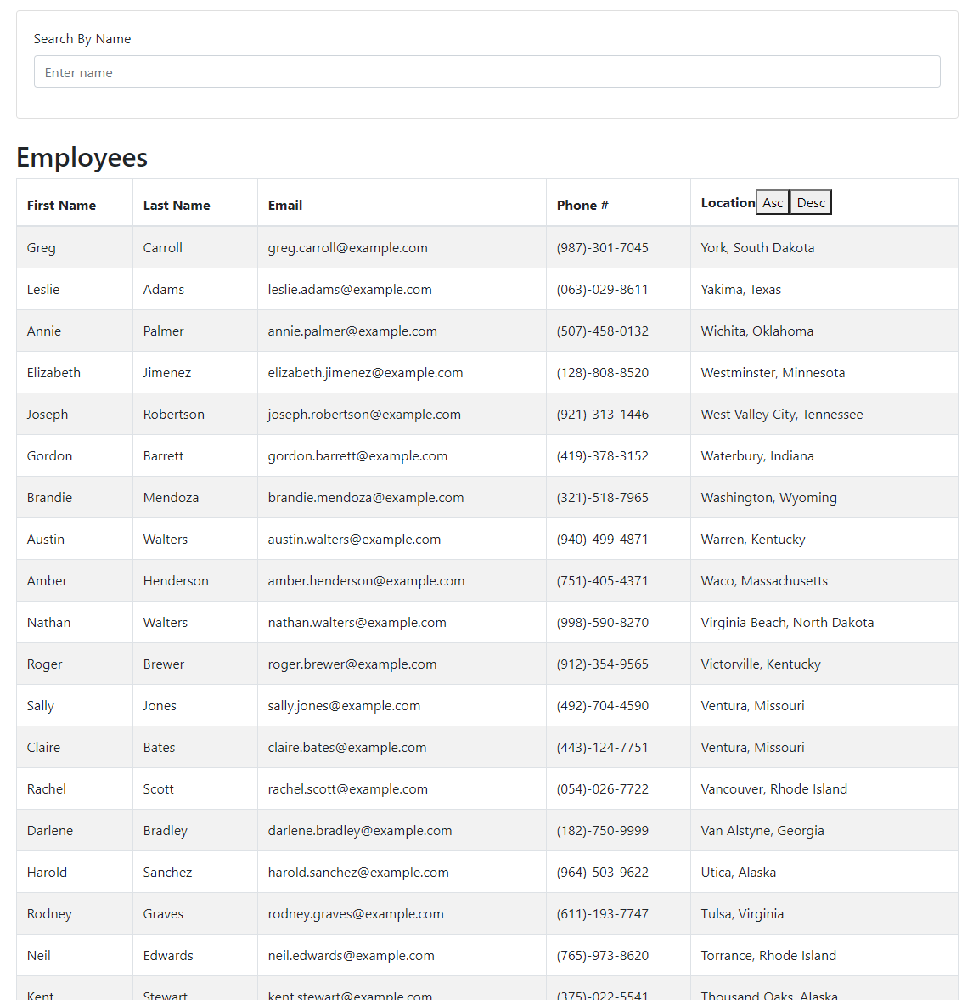

# Employee Directory
Employee directory is an app that lets users view a directory of employees and  filter them using a keyword.

## Application
Please visit [Heroku application](https://rocky-ridge-37011.herokuapp.com/) to check the application.

Here's a screenshot that shows the directory and search box for filtering the employees:
 

## Usage 
This project was bootstrapped with [Create React App](https://github.com/facebook/create-react-app).
In the project directory, you can run: 

### `npm start`
To run the app in the development mode 
Open [http://localhost:3000](http://localhost:3000) to view it in the browser.

### `npm test`

Launches the test runner in the interactive watch mode. 
Please add tests for your changes.
### `npm run build`

Builds the app for production to the `build` folder. 
It correctly bundles React in production mode and optimizes the build for the best performance.

### `npm run eject`

**Note: this is a one-way operation. Once you `eject`, you can’t go back!**

If you aren’t satisfied with the build tool and configuration choices, you can `eject` at any time. This command will remove the single build dependency from your project.

## Contributions
Contributions are welcome. Please make your changes, add test cases for those changes and feel free to send a pull request!